# ✨ Promt-de-Ai

Galería de prompts para IA generativa con vista previa de la imagen resultante y botón para copiar el prompt.

## 🌐 Demo

Publicado con **GitHub Pages**: https://agdala10.github.io/Promt-de-Ai/

## 🖼️ Galería

> 📋 **¿Quieres copiar un prompt?** Haz clic en cualquier imagen o visita la página de **[GitHub Pages](https://agdala10.github.io/Promt-de-Ai/)**, donde puedes ver y copiar cada prompt completo con un solo clic.

<table>
  <tr>
    <td align="center"><a href="https://agdala10.github.io/Promt-de-Ai/">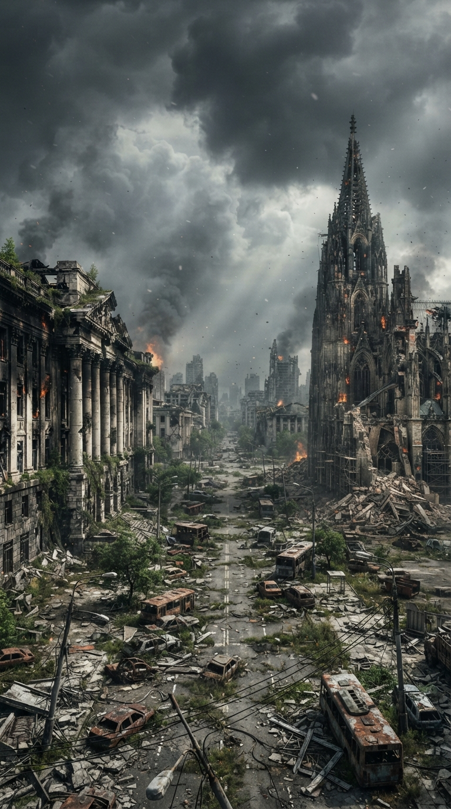</a><br/><sub>Ciudad Apocalíptica</sub></td>
    <td align="center"><a href="https://agdala10.github.io/Promt-de-Ai/">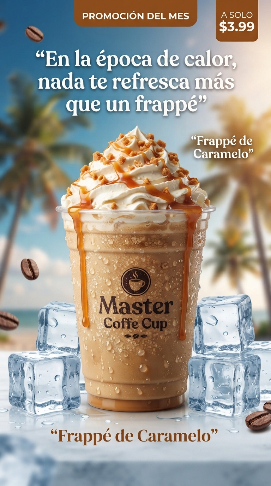</a><br/><sub>Frappé de Caramelo</sub></td>
    <td align="center"><a href="https://agdala10.github.io/Promt-de-Ai/">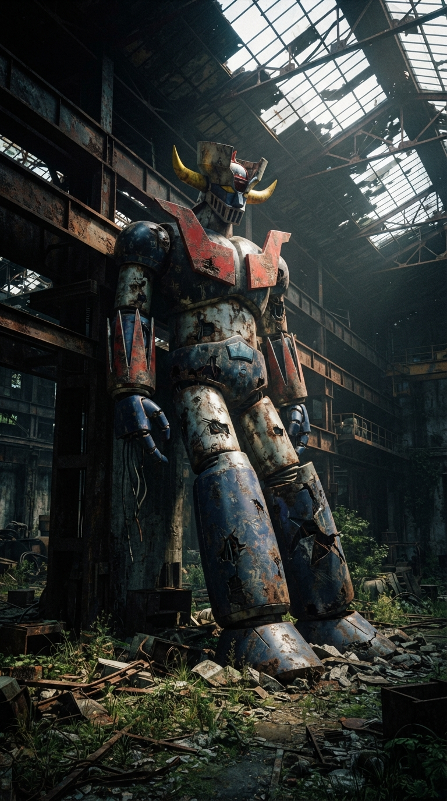</a><br/><sub>Mazinger Z Abandonado</sub></td>
    <td align="center"><a href="https://agdala10.github.io/Promt-de-Ai/"></a><br/><sub>Envíos Marítimos</sub></td>
    <td align="center"><a href="https://agdala10.github.io/Promt-de-Ai/">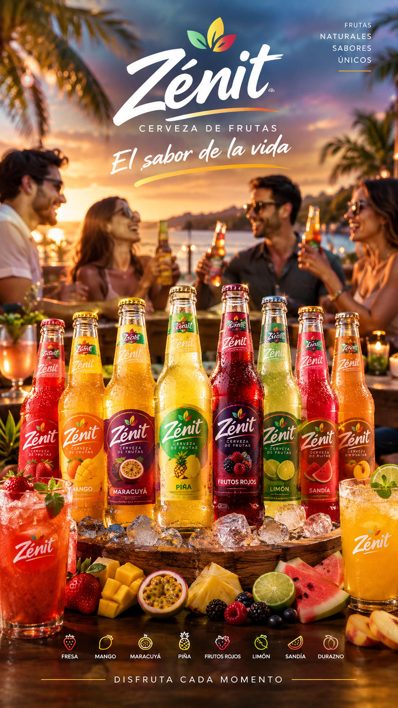</a><br/><sub>Cerveza de Frutas</sub></td>
  </tr>
  <tr>
    <td align="center"><a href="https://agdala10.github.io/Promt-de-Ai/">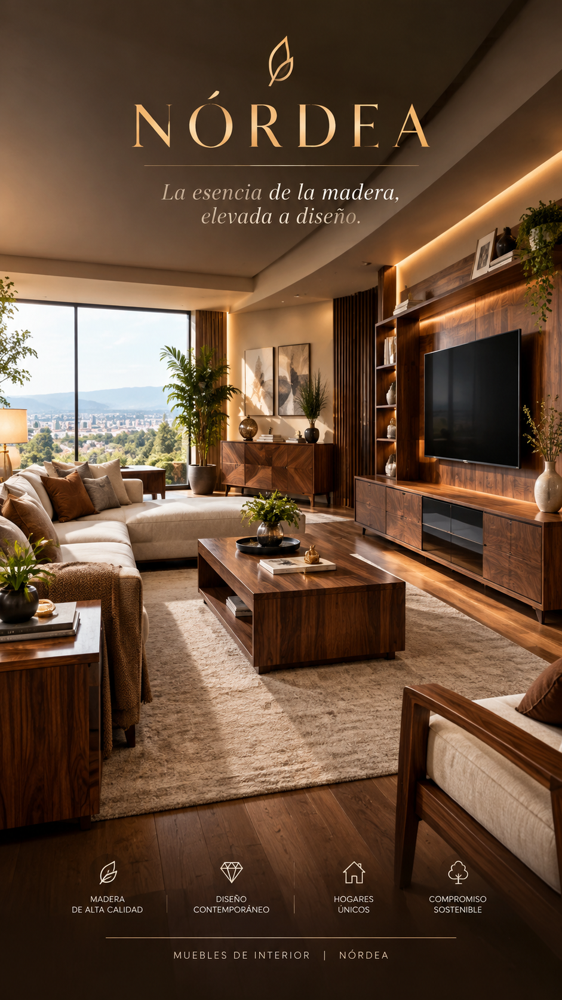</a><br/><sub>Muebles NÓRDEA</sub></td>
    <td align="center"><a href="https://agdala10.github.io/Promt-de-Ai/">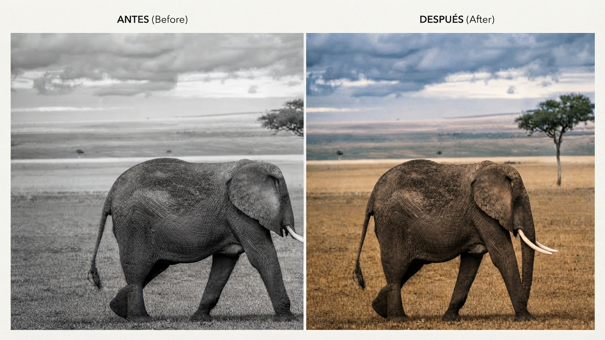</a><br/><sub>Colorear Foto Histórica</sub></td>
    <td align="center"><a href="https://agdala10.github.io/Promt-de-Ai/">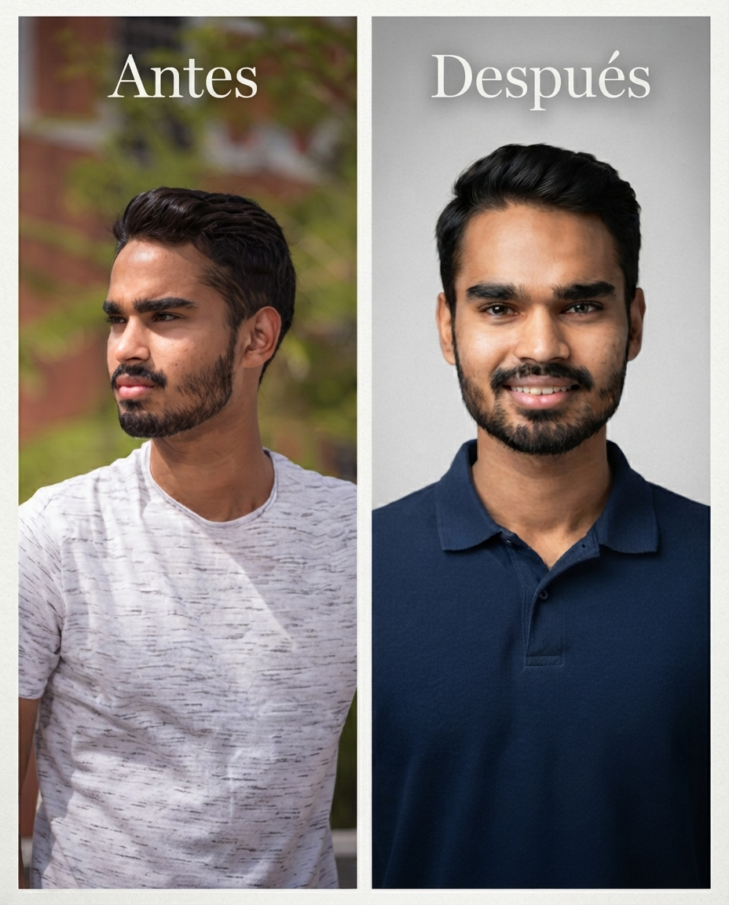</a><br/><sub>Foto Corporativa</sub></td>
    <td align="center"><a href="https://agdala10.github.io/Promt-de-Ai/">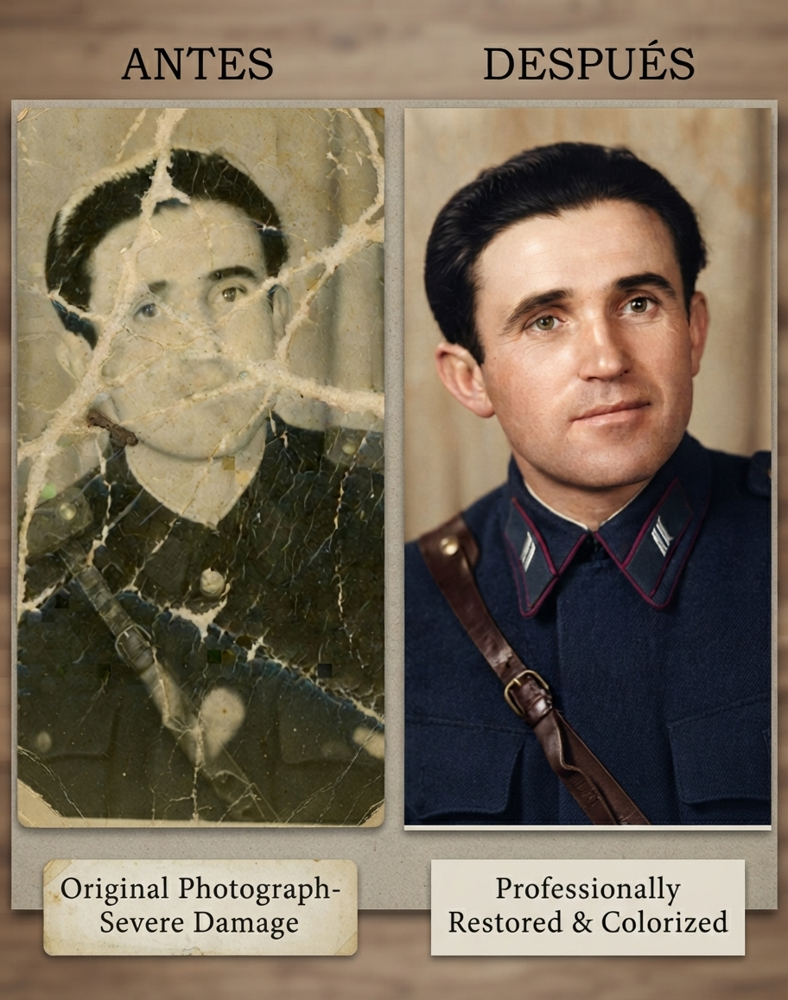</a><br/><sub>Restauración de Foto</sub></td>
    <td align="center"><a href="https://agdala10.github.io/Promt-de-Ai/">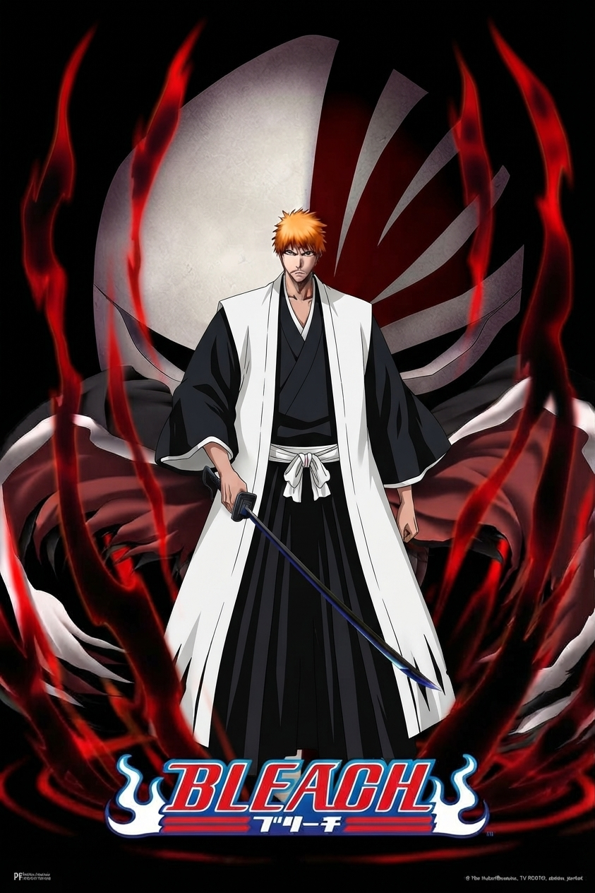</a><br/><sub>Ichigo Kurosaki (Bleach)</sub></td>
  </tr>
  <tr>
    <td align="center"><a href="https://agdala10.github.io/Promt-de-Ai/">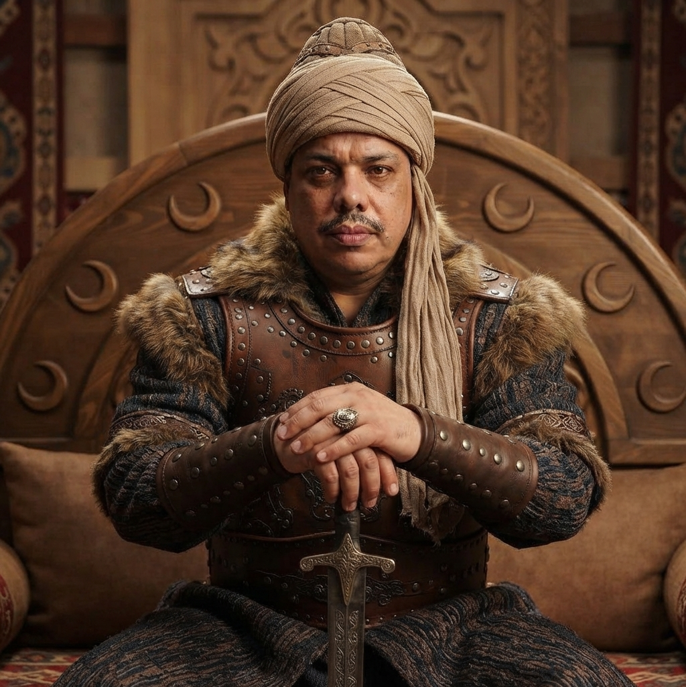</a><br/><sub>Imperio Otomano</sub></td>
    <td align="center"><a href="https://agdala10.github.io/Promt-de-Ai/"></a><br/><sub>Retrato Corporativo</sub></td>
    <td align="center"><a href="https://agdala10.github.io/Promt-de-Ai/">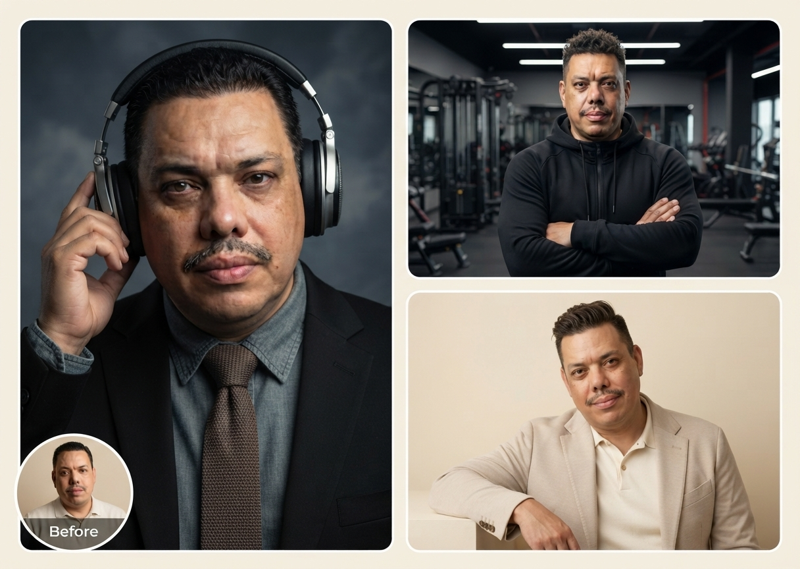</a><br/><sub>Collage de Retratos</sub></td>
    <td align="center"><a href="https://agdala10.github.io/Promt-de-Ai/">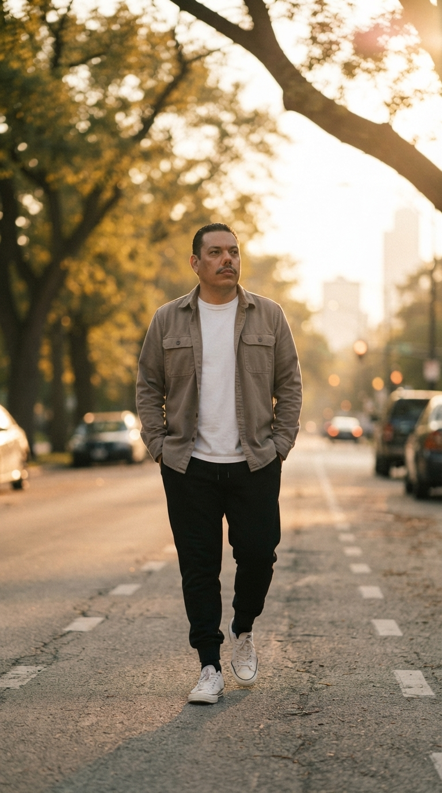</a><br/><sub>Hora Dorada</sub></td>
    <td align="center"><a href="https://agdala10.github.io/Promt-de-Ai/">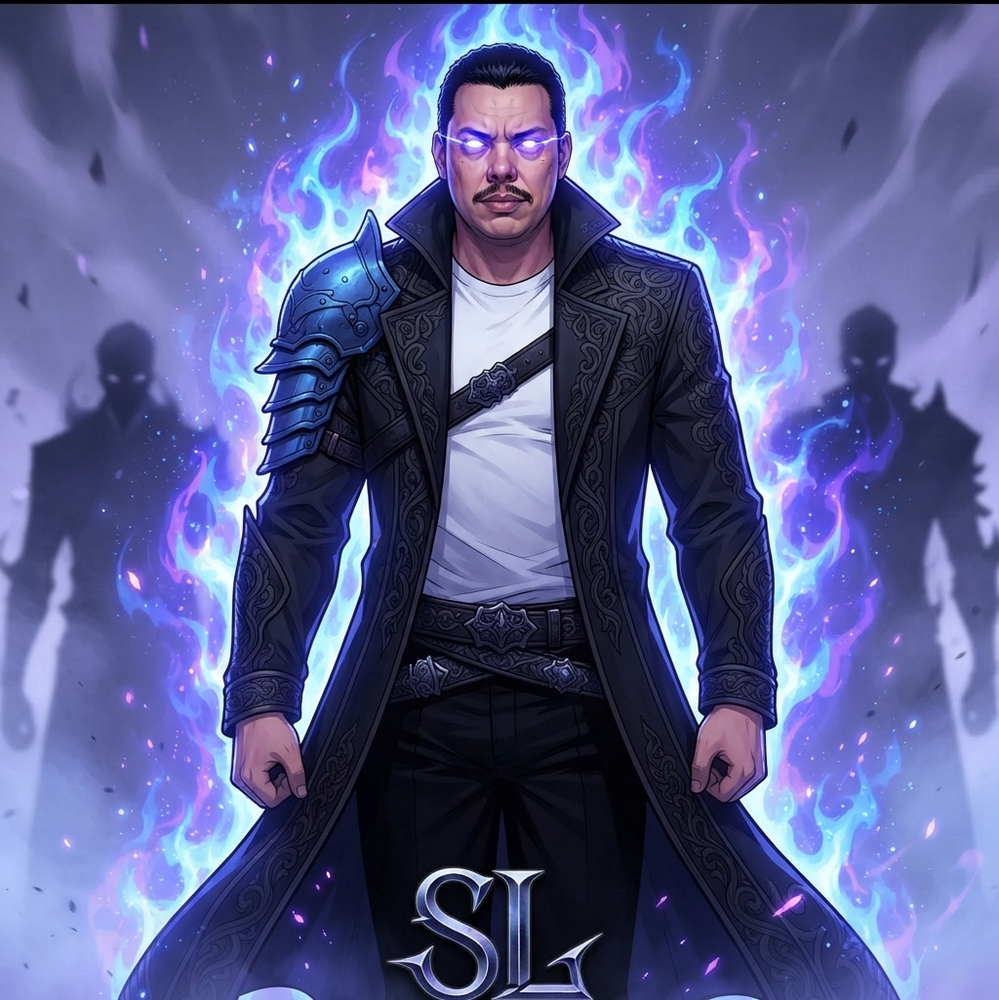</a><br/><sub>Sung Jin-Woo (Solo Leveling)</sub></td>
  </tr>
</table>

👉 **Para copiar cualquier prompt, visita: https://agdala10.github.io/Promt-de-Ai/**

## 🛠️ Tecnologías

- HTML5
- CSS3 (efectos, degradados, sombras, hover)
- JavaScript (vanilla)
- Bootstrap 5 + FontAwesome

## ➕ Cómo agregar más prompts

1. Crea una carpeta en `assets/` con tu imagen.
2. Abre `js/prompts.js` y añade un nuevo objeto al arreglo `PROMPTS`:

```js
{
  "id": 16,
  "title": "Mi prompt",
  "category": "Fotorealista",
  "image": "assets/mi-carpeta/imagen.jpg",
  "prompt": "..."
}
```

3. Sube los cambios a GitHub.

---

✨ Power by Agdala 2026 — Contacto: agdala.s@gmail.com
